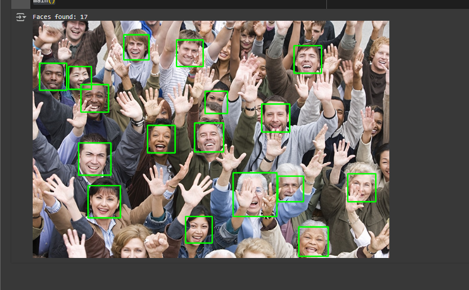

# 👤 Basic Face Detection with OpenCV (Colab-Friendly)

## 📌 Purpose
This project demonstrates a simple implementation of face detection using OpenCV’s Haar Cascade classifier. It's designed to be **beginner-friendly**, **easy to understand**, and **fully compatible with Google Colab**.

---

## 🧠 How It Works

### 🔹 1. Initialization
We load OpenCV’s built-in face detection model:

```python
self.face_cascade = cv2.CascadeClassifier(cv2.data.haarcascades + 'haarcascade_frontalface_default.xml')
```

### 🔹 2. Face Detection
We read the image, convert it to grayscale, then detect and draw rectangles around detected faces:

```python
image = cv2.imread(image_path)
gray = cv2.cvtColor(image, cv2.COLOR_BGR2GRAY)
faces = self.face_cascade.detectMultiScale(gray, 1.1, 5)
```

### 🔹 3. Displaying the Result (Colab Compatible)
Instead of cv2.imshow, we use cv2_imshow for displaying in Google Colab:

```python
from google.colab.patches import cv2_imshow
cv2_imshow(image)
```

---

## 🖼️ Output
After uploading and processing `test_image.jpg`, the code detects faces and draws green rectangles around them:

**Example Output:**



---

## 📘 What I Learned
- How to use OpenCV’s Haar Cascades for face detection.
- How to process and manipulate images with Python.
- How to adapt OpenCV code to work inside Google Colab using cv2_imshow.
- Basic object-oriented programming in Python.
